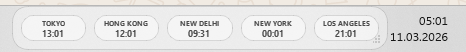

## World Clock Overlay v0.1.0

First public release of a lightweight world clock overlay for Windows.

World Clock Overlay gives you transparent always-on-top clocks that can live as a compact line near the taskbar or as separate floating windows across multiple monitors.

## Highlights

- Transparent, frameless, always-on-top clock widgets
- `Line window` and `Separate window` modes
- Searchable, scrollable city picker
- Unlimited clocks
- 24h / 12h and seconds toggle
- Black and white translucent themes
- Per-window position and size persistence
- System tray controls and Windows autostart
- Offline timezone support with local data only

## Screenshot



## Install

Run from source:

```bat
run_dev.bat
```

Build the executable:

```bat
install.bat
```

Output:

```text
dist\WorldClockOverlay.exe
```

## Notes

- Uses floating overlays, not a native taskbar clock extension
- Works without internet access
- Released under the MIT License
