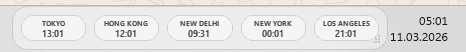

## World Clock Overlay v0.1.0

First public release.

## Highlights

- Transparent, frameless, always-on-top clock widgets
- Line window and separate window layout modes
- 100+ cities with searchable picker
- 24h/12h format and seconds toggle
- Dark and light translucent themes
- Per-window position and size persistence
- System tray with show/hide controls
- Offline timezone support via local data
- Single-file EXE packaging with PyInstaller

## Screenshot



## Install

Run from source:

```bat
run_dev.bat
```

Build the executable:

```bat
install.bat
```

Output:

```text
dist\WorldClockOverlay.exe
```

## Notes

- Floating overlays, not a native taskbar extension
- Works without internet access
- Released under the MIT License
